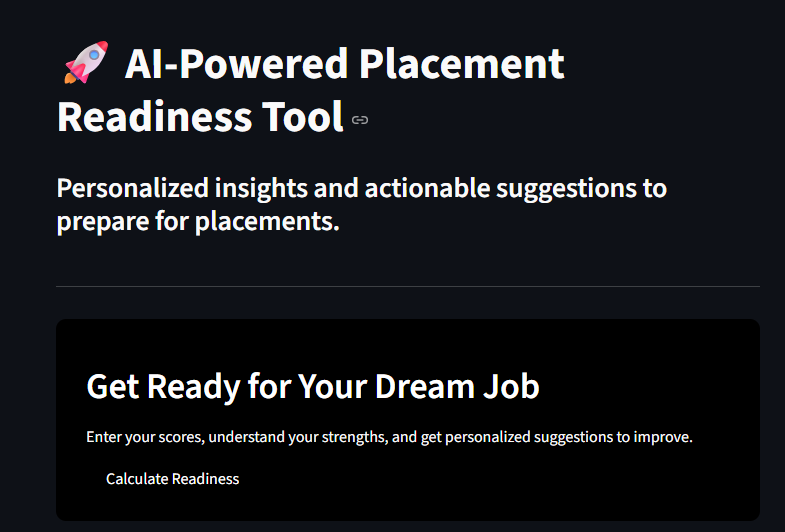

# 🚀 AI-Powered Placement Readiness Tool

A web app that helps students assess their placement readiness, visualize skill gaps, and receive personalized improvement suggestions.

---

## 💡 Features

- **Personalized Readiness Score**: Calculates a readiness score based on your DSA, Core CS, Aptitude, Mock Interviews, Projects, Internship, Communication, and CGPA.  
- **Skill Analysis**: Color-coded bars indicate weak, moderate, and strong skills.  
  - 🔴 Red: Needs improvement  
  - 🟠 Orange: Developing  
  - 🟢 Green: Strong  
- **Actionable Suggestions**: Receive tips to improve your weakest areas.  
- **Interactive Radar Chart**: Visualize all your skills in one glance.  

---

## 🛠️ Tech Stack

- **Python 3**
- **Streamlit** – for interactive web app  
- **Plotly** – for radar charts  
- **Pandas & NumPy** – for data handling  

---

## 📸 Screenshots

  
  
  
  
*Add screenshots of your app here for better impact.*

---

## ⚙️ How to Run

1. Clone the repository:
   ```bash
   git clone https://github.com/PriyankaMurthy39/placement-readiness-tool.git
2.Navigate to the folder:
cd placement-readiness-tool

3.Install dependencies:
pip install -r requirements.txt

4.Run the app:
streamlit run app.py

📈 Example Output
Skill bars showing performance in each category
Readiness score and category (Beginner, Developing, Almost Ready, Placement Ready)
Personalized improvement suggestions

🧑‍💻 Author

Priyanka Murthy
AI & Data Science Student

 
  
 
